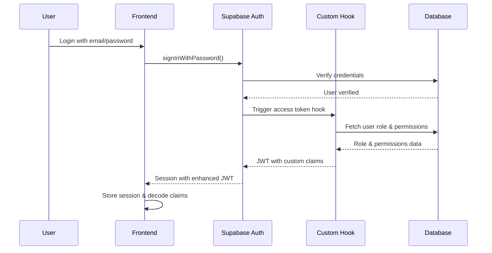

# Supabase Auth with RBAC Implementation Guide

## Overview

This guide explains how the Supabase Auth integration works with our custom RBAC system, providing a complete authentication and authorization solution without building custom services.

## How It Works

### 1. Authentication Flow



### 2. JWT Structure After Custom Hook

```json
{
  // Standard Supabase claims
  "sub": "user-uuid",
  "email": "user@example.com",
  "role": "authenticated",
  "aud": "authenticated",
  "iat": 1234567890,
  "exp": 1234571490,
  
  // Custom RBAC claims added by our hook
  "user_role": "sdr",
  "user_role_display": "Sales Development Representative",
  "role_id": 2,
  "permissions": [
    "persons.view_own",
    "persons.view_team",
    "persons.create",
    "persons.edit_own",
    "tasks.view_own",
    "tasks.create"
  ],
  "rbac_initialized": true
}
```

### 3. Authorization at Different Levels

#### Database Level (RLS Policies)
```sql
-- Automatically enforced, can't be bypassed
CREATE POLICY "View team persons"
ON persons FOR SELECT
USING (
  auth.has_permission('persons.view_team')
  AND auth.is_above_in_hierarchy(owner_id)
);
```

#### API Level
```typescript
// No custom middleware needed!
// RLS handles authorization automatically
const { data, error } = await supabase
  .from('persons')
  .select('*') // RLS filters results based on user's permissions
```

#### Frontend Level
```tsx
// Conditional rendering
<PermissionGate permissions="persons.create">
  <Button>Add New Person</Button>
</PermissionGate>

// Programmatic checks
const canEdit = usePermissionCheck(['persons.edit_own', 'persons.edit_all'])
```

## Implementation Steps

### Step 1: Database Setup ✅
- Created roles, permissions, and role_permissions tables
- Created helper functions for authorization
- Set up RLS policies using JWT claims

### Step 2: Supabase Configuration ✅
- Enable email authentication in dashboard
- Configure JWT settings
- Set up email templates
- Create custom access token hook

### Step 3: Frontend Integration ✅
- Set up Supabase client
- Create AuthContext for state management
- Build PermissionGate components
- Implement route protection

## Usage Examples

### Basic Authentication

```typescript
// Sign in
const { data, error } = await supabase.auth.signInWithPassword({
  email: 'user@example.com',
  password: 'password123'
})

// Sign up
const { data, error } = await supabase.auth.signUp({
  email: 'new@example.com',
  password: 'password123',
  options: {
    data: {
      firstName: 'John',
      lastName: 'Doe'
    }
  }
})

// Sign out
await supabase.auth.signOut()
```

### Permission Checks

```typescript
// In React components
const { hasPermission } = useAuth()

if (hasPermission('persons.edit_all')) {
  // Show admin features
}

// Using PermissionGate
<PermissionGate permissions={['persons.edit_own', 'persons.edit_team']}>
  <EditButton />
</PermissionGate>

// Protected routes
export const AdminPage = withAuth(AdminComponent, {
  permissions: ['admin.access'],
  redirectTo: '/login'
})
```

### Database Queries

```typescript
// Queries are automatically filtered by RLS
const { data: myPersons } = await supabase
  .from('persons')
  .select('*') // Only returns persons user has permission to see

// No need to add filters like .eq('owner_id', userId)
// RLS handles it automatically!
```

## Key Benefits

1. **No Custom Auth Code**: Leveraging Supabase's battle-tested auth system
2. **Automatic Security**: RLS policies can't be bypassed
3. **Single Source of Truth**: Permissions defined in database, enforced everywhere
4. **Performance**: JWT claims cached, no extra lookups needed
5. **Flexibility**: Easy to add new roles and permissions through database

## Migration from Old System

### Before (Custom Middleware)
```typescript
// Old approach - checking roles in API
router.get('/persons', authMiddleware, (req, res) => {
  if (req.user.role === 'admin' || req.user.role === 'sdr') {
    // Fetch persons
  }
})
```

### After (Supabase RLS)
```typescript
// New approach - RLS handles everything
const { data } = await supabase
  .from('persons')
  .select('*') // Automatically filtered by permissions
```

## Testing

### Test User Creation
```sql
-- Create test user with specific role
INSERT INTO auth.users (email, raw_app_meta_data)
VALUES ('test@example.com', '{"provider":"email"}');

INSERT INTO users (id, email, first_name, last_name, role_id)
VALUES (
  (SELECT id FROM auth.users WHERE email = 'test@example.com'),
  'test@example.com',
  'Test',
  'User',
  (SELECT id FROM roles WHERE name = 'sdr')
);
```

### Test Permission Checks
```sql
-- As the test user
SELECT auth.has_permission('persons.view_team'); -- Should return true/false
SELECT auth.jwt() -> 'permissions'; -- Shows all permissions
```

## Troubleshooting

### Issue: Permissions not showing in JWT
- Check if custom access token hook is deployed and enabled
- Verify user has a role assigned in the users table
- Check Supabase logs for hook errors

### Issue: RLS policies blocking all access
- Verify user is authenticated: `SELECT auth.uid()`
- Check JWT contents: `SELECT auth.jwt()`
- Test specific permissions: `SELECT auth.has_permission('permission.name')`

### Issue: Frontend not updating after permission change
- Permissions are cached in JWT until token refresh
- Force refresh: `await supabase.auth.refreshSession()`
- Or wait for automatic refresh (every hour by default)

## Next Steps

1. Complete remaining API updates (Phase 3)
2. Update all UI components to use PermissionGate (Phase 4)
3. Remove old role-based code
4. Test with different user roles
5. Deploy to production